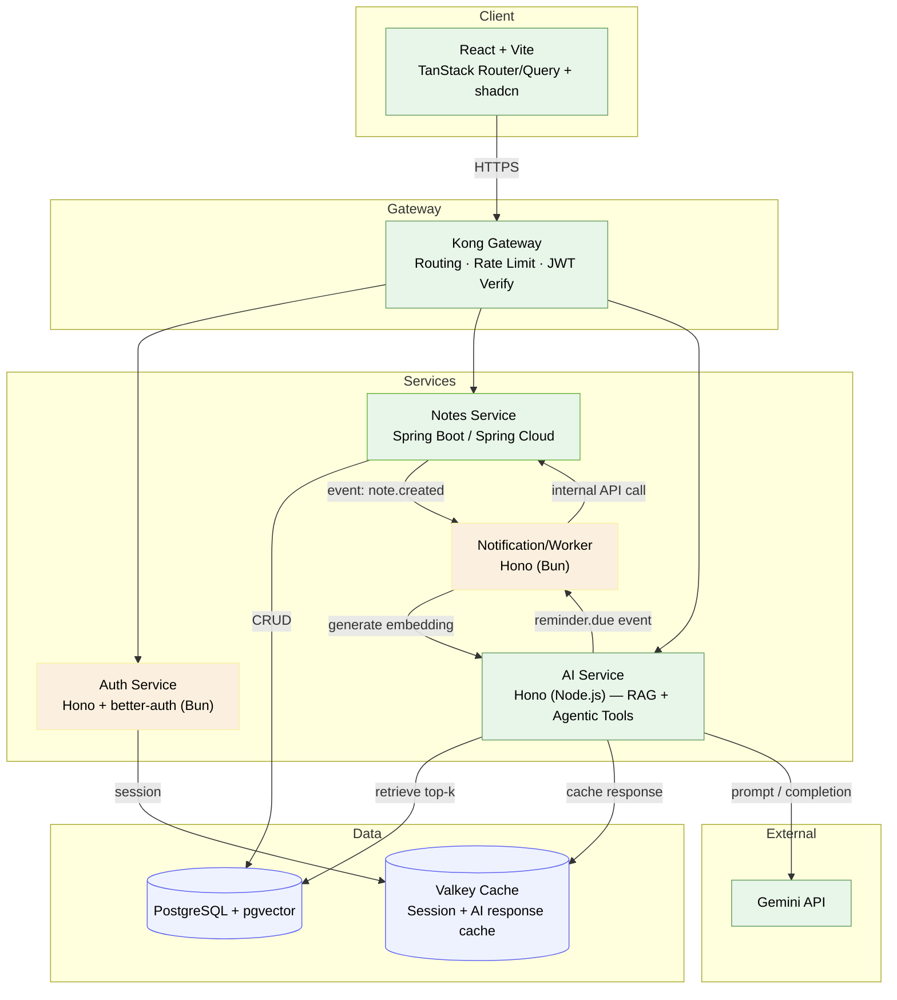

<a id="readme-top"></a>

<div align="center">

[![Contributors][contributors-shield]][contributors-url]
[![Forks][forks-shield]][forks-url]
[![Stargazers][stars-shield]][stars-url]
[![Issues][issues-shield]][issues-url]
[![MIT License][license-shield]][license-url]
[![LinkedIn][linkedin-shield]][linkedin-url]

[![Bun][bun-shield]][bun-url]
[![Node.js][node-shield]][node-url]
[![Hono][hono-shield]][hono-url]
[![Spring Boot][spring-shield]][spring-url]
[![React][react-shield]][react-url]
[![Vite][vite-shield]][vite-url]
[![TanStack Query][tanstack-shield]][tanstack-url]
[![Kong][kong-shield]][kong-url]
[![PostgreSQL][postgres-shield]][postgres-url]
[![pgvector][pgvector-shield]][pgvector-url]
[![Valkey][valkey-shield]][valkey-url]
[![Kubernetes][k8s-shield]][k8s-url]
[![Google Cloud][gcp-shield]][gcp-url]

</div>

<br />
<div align="center">
  <h3 align="center">🧠 Synapse</h3>

  <p align="center">
    An AI-powered personal knowledge assistant — capture notes, chat with them via RAG, and let agentic tools handle reminders for you.
    <br />
    <a href="https://github.com/nbnguyen75/Synapse"><strong>Explore the docs »</strong></a>
    <br />
    <br />
    <a href="https://github.com/nbnguyen75/Synapse">View Demo</a>
    ·
    <a href="https://github.com/nbnguyen75/Synapse/issues/new?labels=bug&template=bug-report---.md">Report Bug</a>
    ·
    <a href="https://github.com/nbnguyen75/Synapse/issues/new?labels=enhancement&template=feature-request---.md">Request Feature</a>
  </p>
</div>

<details>
  <summary>Table of Contents</summary>
  <ol>
    <li>
      <a href="#about-the-project">About The Project</a>
      <ul>
        <li><a href="#built-with">Built With</a></li>
      </ul>
    </li>
    <li><a href="#architecture">Architecture</a></li>
    <li>
      <a href="#getting-started">Getting Started</a>
      <ul>
        <li><a href="#prerequisites">Prerequisites</a></li>
        <li><a href="#installation">Installation</a></li>
      </ul>
    </li>
    <li><a href="#usage">Usage</a></li>
    <li><a href="#roadmap">Roadmap</a></li>
    <li><a href="#contributing">Contributing</a></li>
    <li><a href="#license">License</a></li>
    <li><a href="#contact">Contact</a></li>
    <li><a href="#acknowledgments">Acknowledgments</a></li>
  </ol>
</details>

## About The Project

**Synapse** is a personal knowledge assistant that turns your notes into a queryable, AI-powered second brain. Create notes, and the system automatically embeds them; chat with an AI that retrieves relevant notes (RAG) to answer your questions; let agentic tool-calling handle follow-up actions like generating reminders straight from note content.

The project is deliberately built as a small polyglot microservices system — mixing runtimes and frameworks on purpose — to demonstrate system-design thinking rather than a single-stack CRUD app:

| Service | Stack | Why |
|---|---|---|
| Auth | Hono + better-auth on **Bun** | Fast cold-start, ideal for a small, focused service |
| Notes | **Java Spring Boot / Spring Cloud** | Enterprise-grade, cloud-native microservice patterns |
| AI Service | Hono on **Node.js** | Needs the mature Node AI SDK ecosystem for RAG/tool-calling |
| Notification/Worker | Hono on **Bun** | Lightweight event consumer |
| Gateway | **Kong** | Routing, rate limiting, JWT verification |
| Client | React + Vite + TanStack Router/Query + shadcn | Modern, type-safe SPA tooling |

<p align="right">(<a href="#readme-top">back to top</a>)</p>

### Built With

* [![Bun][bun-shield]][bun-url]
* [![Node.js][node-shield]][node-url]
* [![Hono][hono-shield]][hono-url]
* [![Spring Boot][spring-shield]][spring-url]
* [![React][react-shield]][react-url]
* [![Vite][vite-shield]][vite-url]
* [![Kong][kong-shield]][kong-url]
* [![PostgreSQL][postgres-shield]][postgres-url]
* [![Kubernetes][k8s-shield]][k8s-url]
* [![Google Cloud][gcp-shield]][gcp-url]

<p align="right">(<a href="#readme-top">back to top</a>)</p>

## Architecture



**Request flow (RAG chat example):**
1. Client authenticates via **Auth Service**, receiving a JWT.
2. Requests pass through **Kong**, which verifies the JWT and routes to the target service.
3. **Notes Service** persists notes in PostgreSQL and emits a `note.created` event.
4. The **Worker** picks up the event and asks the **AI Service** to generate embeddings, stored via pgvector.
5. On chat, the **AI Service** retrieves top-k relevant notes, builds a prompt, and calls **Gemini**, optionally caching the response in **Valkey**.
6. Agentic tool-calls (e.g., reminders) call back into **Notes Service** or trigger `reminder.due` events for the **Worker** to notify the user.

<p align="right">(<a href="#readme-top">back to top</a>)</p>

## Getting Started

This is an example of how you may give instructions on setting up the project locally.
To get a local copy up and running, follow these steps.

### Prerequisites

* [Bun](https://bun.sh/)
```sh
  curl -fsSL https://bun.sh/install | bash
```
* Node.js (LTS)
* Java 21+ and Maven/Gradle
* Docker & Docker Compose
* [kind](https://kind.sigs.k8s.io/) (for local Kubernetes)

### Installation

1. Clone the repo
```sh
   git clone https://github.com/nbnguyen75/Synapse.git
```
2. Start local infra (Postgres + pgvector)
```sh
   docker compose up -d
```
3. Install dependencies per service
```sh
   cd services/auth && bun install
   cd services/ai && npm install
   cd services/notes && ./mvnw install
   cd client && npm install
```
4. Configure environment variables
```sh
   cp .env.example .env
   # set DATABASE_URL, JWT_SECRET, GEMINI_API_KEY, etc.
```
5. Change git remote url to avoid accidental pushes to the base project
```sh
   git remote set-url origin nbnguyen75/Synapse
   git remote -v # confirm the changes
```

<p align="right">(<a href="#readme-top">back to top</a>)</p>

## Usage

* Register/login via the Auth Service.
* Create notes through the client — embeddings are generated automatically.
* Open the chat panel to ask questions about your notes (RAG).
* Ask the AI to "remind me about X" — agentic tool-calling creates a reminder automatically.

_For more examples, please refer to the [Documentation](https://example.com)_

<p align="right">(<a href="#readme-top">back to top</a>)</p>

## Roadmap

- [x] MVP: Auth + Notes + AI Service (sync RAG) behind Kong, deployed to GKE Autopilot
- [ ] Event-driven embedding pipeline (RabbitMQ)
- [ ] Structured logging & observability (Actuator, pino, Cloud Monitoring)
- [ ] Advanced multi-step agentic tool-calling
- [ ] Valkey caching with measured latency improvements
- [ ] Spring Cloud Config / Gateway exploration
- [ ] HPA autoscaling, circuit breakers, load testing (k6)

See the [open issues](https://github.com/nbnguyen75/Synapse/issues) for a full list of proposed features and known issues.

<p align="right">(<a href="#readme-top">back to top</a>)</p>

## Contributing

Contributions are what make the open source community such an amazing place to learn, inspire, and create. Any contributions you make are **greatly appreciated**.

1. Fork the Project
2. Create your Feature Branch (`git checkout -b feature/AmazingFeature`)
3. Commit your Changes (`git commit -m 'Add some AmazingFeature'`)
4. Push to the Branch (`git push origin feature/AmazingFeature`)
5. Open a Pull Request

<p align="right">(<a href="#readme-top">back to top</a>)</p>

## License

Distributed under the MIT License. See `LICENSE.txt` for more information.

<p align="right">(<a href="#readme-top">back to top</a>)</p>

## Contact

Your Name - [@twitter_handle](https://twitter.com/twitter_handle) - email@email_client.com

Project Link: [https://github.com/nbnguyen75/Synapse](https://github.com/nbnguyen75/Synapse)

<p align="right">(<a href="#readme-top">back to top</a>)</p>

## Acknowledgments

* [Best-README-Template](https://github.com/othneildrew/Best-README-Template)
* [Vercel AI SDK](https://sdk.vercel.ai/)
* [pgvector](https://github.com/pgvector/pgvector)

<p align="right">(<a href="#readme-top">back to top</a>)</p>

<!-- MARKDOWN LINKS & IMAGES -->
[contributors-shield]: https://img.shields.io/github/contributors/nbnguyen75/Synapse.svg?style=for-the-badge
[contributors-url]: https://github.com/nbnguyen75/Synapse/graphs/contributors
[forks-shield]: https://img.shields.io/github/forks/nbnguyen75/Synapse.svg?style=for-the-badge
[forks-url]: https://github.com/nbnguyen75/Synapse/network/members
[stars-shield]: https://img.shields.io/github/stars/nbnguyen75/Synapse.svg?style=for-the-badge
[stars-url]: https://github.com/nbnguyen75/Synapse/stargazers
[issues-shield]: https://img.shields.io/github/issues/nbnguyen75/Synapse.svg?style=for-the-badge
[issues-url]: https://github.com/nbnguyen75/Synapse/issues
[license-shield]: https://img.shields.io/github/license/nbnguyen75/Synapse.svg?style=for-the-badge
[license-url]: https://github.com/nbnguyen75/Synapse/blob/master/LICENSE.txt
[linkedin-shield]: https://img.shields.io/badge/-LinkedIn-black.svg?style=for-the-badge&logo=linkedin&colorB=555
[linkedin-url]: https://linkedin.com/in/linkedin_username

[bun-shield]: https://img.shields.io/badge/Bun-000000?style=for-the-badge&logo=bun&logoColor=white
[bun-url]: https://bun.sh/
[node-shield]: https://img.shields.io/badge/Node.js-339933?style=for-the-badge&logo=nodedotjs&logoColor=white
[node-url]: https://nodejs.org/
[hono-shield]: https://img.shields.io/badge/Hono-E36002?style=for-the-badge&logo=hono&logoColor=white
[hono-url]: https://hono.dev/
[spring-shield]: https://img.shields.io/badge/Spring_Boot-6DB33F?style=for-the-badge&logo=springboot&logoColor=white
[spring-url]: https://spring.io/projects/spring-boot
[react-shield]: https://img.shields.io/badge/React-20232A?style=for-the-badge&logo=react&logoColor=61DAFB
[react-url]: https://reactjs.org/
[vite-shield]: https://img.shields.io/badge/Vite-646CFF?style=for-the-badge&logo=vite&logoColor=white
[vite-url]: https://vitejs.dev/
[tanstack-shield]: https://img.shields.io/badge/TanStack_Query-FF4154?style=for-the-badge&logo=reactquery&logoColor=white
[tanstack-url]: https://tanstack.com/query
[kong-shield]: https://img.shields.io/badge/Kong-003459?style=for-the-badge&logo=kong&logoColor=white
[kong-url]: https://konghq.com/
[postgres-shield]: https://img.shields.io/badge/PostgreSQL-4169E1?style=for-the-badge&logo=postgresql&logoColor=white
[postgres-url]: https://www.postgresql.org/
[pgvector-shield]: https://img.shields.io/badge/pgvector-4169E1?style=for-the-badge&logo=postgresql&logoColor=white
[pgvector-url]: https://github.com/pgvector/pgvector
[valkey-shield]: https://img.shields.io/badge/Valkey-A41E11?style=for-the-badge&logo=redis&logoColor=white
[valkey-url]: https://valkey.io/
[k8s-shield]: https://img.shields.io/badge/Kubernetes-326CE5?style=for-the-badge&logo=kubernetes&logoColor=white
[k8s-url]: https://kubernetes.io/
[gcp-shield]: https://img.shields.io/badge/Google_Cloud-4285F4?style=for-the-badge&logo=googlecloud&logoColor=white
[gcp-url]: https://cloud.google.com/