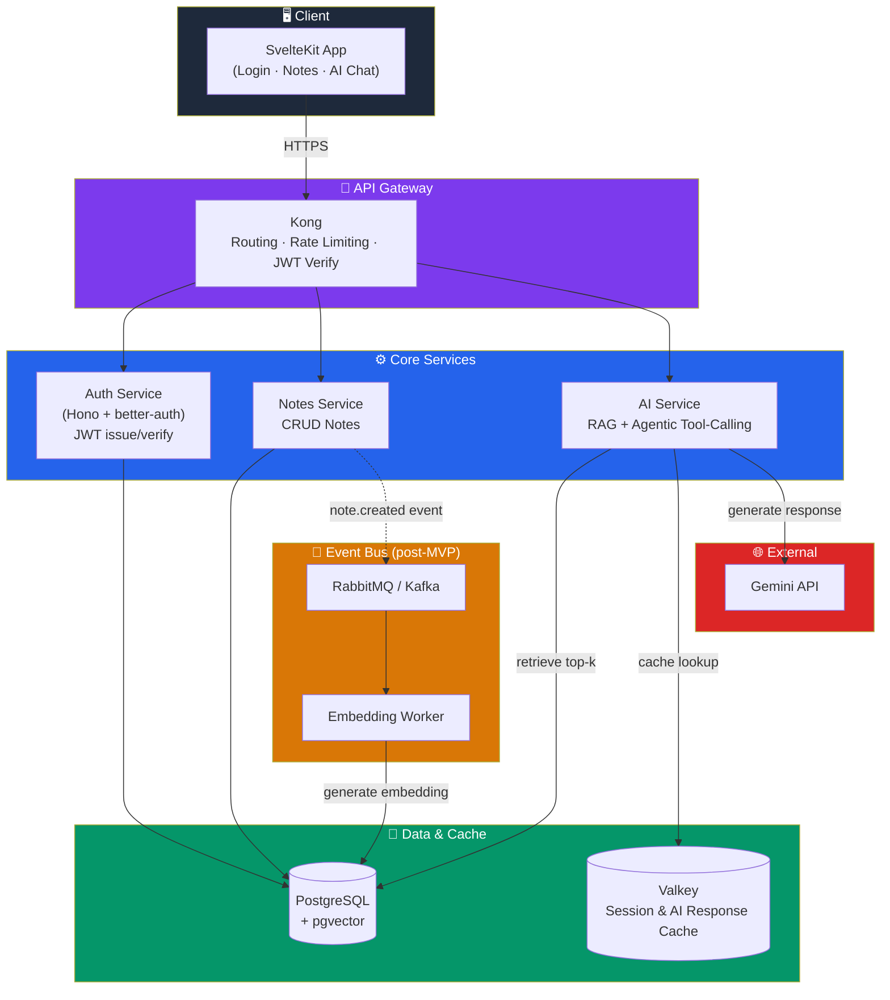
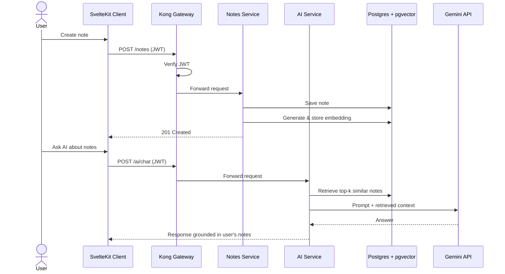

<a id="readme-top"></a>


<div align="center">

[![Contributors][contributors-shield]][contributors-url]
[![Forks][forks-shield]][forks-url]
[![Stargazers][stars-shield]][stars-url]
[![Issues][issues-shield]][issues-url]
[![License][license-shield]][license-url]

</div>

<!-- PROJECT LOGO -->
<br />
<div align="center">
  <h3 align="center">🧠 Synapse</h3>

  <p align="center">
    A personal AI-powered knowledge assistant — notes that you can chat with.
    <br />
    <em>End-to-end showcase project: microservices, event-driven architecture, RAG & agentic AI on Kubernetes</em>
    <br />
    <br />
    <a href="#architecture"><strong>Explore the Architecture »</strong></a>
    <br />
    <br />
    <a href="#roadmap">Roadmap</a>
    ·
    <a href="https://github.com/nbnguyen75/synapse/issues/new?labels=bug&template=bug-report---.md">Report Bug</a>
    ·
    <a href="https://github.com/nbnguyen75/synapse/issues/new?labels=enhancement&template=feature-request---.md">Request Feature</a>
  </p>
</div>

<!-- TABLE OF CONTENTS -->
<details>
  <summary>Table of Contents</summary>
  <ol>
    <li><a href="#about-the-project">About The Project</a></li>
    <li><a href="#architecture">Architecture</a>
      <ul>
        <li><a href="#high-level-system-diagram">High-Level System Diagram</a></li>
        <li><a href="#core-flow-note-creation--rag-chat">Core Flow: Note Creation & RAG Chat</a></li>
      </ul>
    </li>
    <li><a href="#built-with">Built With</a></li>
    <li><a href="#core-features">Core Features</a></li>
    <li><a href="#getting-started">Getting Started</a>
      <ul>
        <li><a href="#prerequisites">Prerequisites</a></li>
        <li><a href="#installation">Installation</a></li>
      </ul>
    </li>
    <li><a href="#usage">Usage</a></li>
    <li><a href="#roadmap">Roadmap</a></li>
    <li><a href="#contributing">Contributing</a></li>
    <li><a href="#license">License</a></li>
    <li><a href="#contact">Contact</a></li>
    <li><a href="#acknowledgments">Acknowledgments</a></li>
  </ol>
</details>

<!-- ABOUT THE PROJECT -->
## About The Project

**Synapse** is a Personal Knowledge Assistant: users write notes, the system automatically generates embeddings for them, and users can "chat" with an AI that retrieves relevant notes (RAG) to answer questions — plus agentic features like auto-creating reminders from note content.

This project isn't just a CRUD app — it's an **end-to-end architecture showcase**, deliberately built in growth stages (MVP → event-driven → observability → advanced agentic → caching with measured justification → optional Kafka migration → scaling/resilience) so that every technical decision has a clear "why," not just a checkbox on a CV.

<p align="right">(<a href="#readme-top">back to top</a>)</p>

<!-- ARCHITECTURE -->
## Architecture

### High-Level System Diagram



### Core Flow: Note Creation & RAG Chat



<p align="right">(<a href="#readme-top">back to top</a>)</p>

### Built With

* [](https://kit.svelte.dev/)
* [](https://hono.dev/)
* [](https://www.postgresql.org/)
* [](https://kubernetes.io/)
* [](https://konghq.com/)
* [](https://www.rabbitmq.com/)
* [](https://cloud.google.com/)
* [](https://ai.google.dev/)
* [](https://valkey.io/)

<p align="right">(<a href="#readme-top">back to top</a>)</p>

<!-- CORE FEATURES -->
## Core Features

| Group | Feature |
|---|---|
| Auth | Register/login, JWT access + refresh tokens, basic RBAC (user/admin) |
| Core Domain | Notes CRUD, automatic embedding generation on create/update |
| AI Service | RAG chat over personal notes, agentic tool-calling (e.g. summarize, create reminders from note content) |
| Gateway | Kong routing, rate limiting, JWT verification at the gateway |
| Async/Event | `note.created` → embedding job; `reminder.due` → notification |
| Infra | Service discovery via k8s DNS, ConfigMap per service, Valkey cache for sessions + AI response cache |
| Observability | Centralized logging, health checks, (later stage) tracing/metrics |
| Client | SvelteKit: login, notes management, AI chat UI |

<p align="right">(<a href="#readme-top">back to top</a>)</p>

<!-- GETTING STARTED -->
## Getting Started

To get a local copy up and running, follow these steps.

### Prerequisites

* [Bun](https://bun.sh) (used instead of Node/npm for all services)

```sh
  curl -fsSL https://bun.sh/install | bash
```

* Docker & Docker Compose

* A Gemini API key from [Google AI Studio](https://aistudio.google.com/)

### Installation

1. Clone the repo

```sh
   git clone https://github.com/nbnguyen75/synapse.git
   cd synapse
```

2. Install dependencies with Bun

```sh
   bun install
```

3. Copy the environment template and set your API key

```sh
   cp .env.example .env
   # then edit .env and set GEMINI_API_KEY=your_key_here
```

4. Start local infrastructure (Postgres + pgvector)

```sh
   docker compose up -d
```

5. Run services locally

```sh
   bun run dev
```

6. Change git remote url to avoid accidental pushes to the base project

```sh
   git remote set-url origin nbnguyen75/synapse
   git remote -v # confirm the changes
```

<p align="right">(<a href="#readme-top">back to top</a>)</p>

<!-- USAGE -->
## Usage

1. Register/login through the SvelteKit client.
2. Create a note — an embedding is generated automatically (sync in MVP, async via event bus in later stages).
3. Open the AI chat panel and ask a question about your notes — Synapse retrieves relevant notes via `pgvector` and answers using Gemini, grounded in your own data.

<p align="right">(<a href="#readme-top">back to top</a>)</p>

<!-- ROADMAP -->
## Roadmap

- [x] **MVP** — Auth, Notes CRUD, simple RAG, Kong gateway, SvelteKit client, deployed on GKE Autopilot
- [ ] **Event-driven** — Move embedding generation to async via RabbitMQ + worker
- [ ] **Observability** — Structured logging, health checks, Cloud Monitoring/Logging integration
- [ ] **Advanced Agentic** — Multi-step tool-calling (create reminder, search related notes, call weather API)
- [ ] **Valkey caching** — Cache AI responses & sessions, backed by measured latency improvements
- [ ] *(Optional)* **Kafka migration** — Event replay & multi-consumer support
- [ ] **Scaling & Resilience** — HPA autoscaling, circuit breakers, load testing with k6

See the [open issues](https://github.com/nbnguyen75/synapse/issues) for a full list of proposed features and known issues.

<p align="right">(<a href="#readme-top">back to top</a>)</p>

<!-- CONTRIBUTING -->
## Contributing

Contributions are what make the open source community such an amazing place to learn, inspire, and create. Any contributions you make are **greatly appreciated**.

1. Fork the Project
2. Create your Feature Branch (`git checkout -b feature/AmazingFeature`)
3. Commit your Changes (`git commit -m 'Add some AmazingFeature'`)
4. Push to the Branch (`git push origin feature/AmazingFeature`)
5. Open a Pull Request

<p align="right">(<a href="#readme-top">back to top</a>)</p>

<!-- LICENSE -->
## License

Distributed under the MIT License. See `LICENSE.txt` for more information.

<p align="right">(<a href="#readme-top">back to top</a>)</p>

<!-- CONTACT -->
## Contact

Your Name - [@twitter_handle](https://twitter.com/twitter_handle) - your.email@example.com

Project Link: [https://github.com/nbnguyen75/synapse](https://github.com/nbnguyen75/synapse)

<p align="right">(<a href="#readme-top">back to top</a>)</p>

<!-- ACKNOWLEDGMENTS -->
## Acknowledgments

* [Best-README-Template](https://github.com/othneildrew/Best-README-Template)
* [Kong Gateway](https://konghq.com/)
* [pgvector](https://github.com/pgvector/pgvector)
* [Shields.io](https://shields.io)

<p align="right">(<a href="#readme-top">back to top</a>)</p>

<!-- MARKDOWN LINKS & IMAGES -->
[contributors-shield]: https://img.shields.io/github/contributors/nbnguyen75/synapse.svg?style=for-the-badge
[contributors-url]: https://github.com/nbnguyen75/synapse/graphs/contributors
[forks-shield]: https://img.shields.io/github/forks/nbnguyen75/synapse.svg?style=for-the-badge
[forks-url]: https://github.com/nbnguyen75/synapse/network/members
[stars-shield]: https://img.shields.io/github/stars/nbnguyen75/synapse.svg?style=for-the-badge
[stars-url]: https://github.com/nbnguyen75/synapse/stargazers
[issues-shield]: https://img.shields.io/github/issues/nbnguyen75/synapse.svg?style=for-the-badge
[issues-url]: https://github.com/nbnguyen75/synapse/issues
[license-shield]: https://img.shields.io/github/license/nbnguyen75/synapse.svg?style=for-the-badge
[license-url]: https://github.com/nbnguyen75/synapse/blob/master/LICENSE.txt
[linkedin-shield]: https://img.shields.io/badge/-LinkedIn-black.svg?style=for-the-badge&logo=linkedin&colorB=555
[linkedin-url]: https://linkedin.com/in/linkedin_username