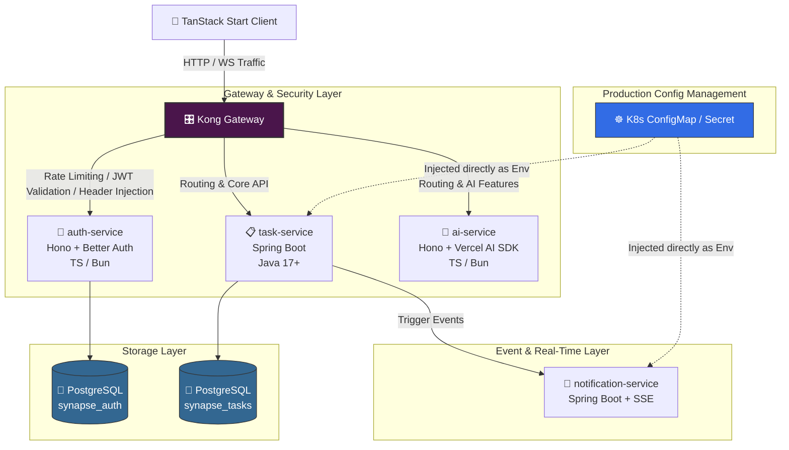

# 🧠 SYNAPSE — Multi-Tenant AI Task Management Platform

<p align="center">
  
  
  
  
  
</p>

---

## 🌌 What is Synapse?

**Synapse** is a multi-tenant task management platform featuring AI-powered sprint retrospectives. It is built on a high-performance polyglot microservices architecture utilizing **TypeScript/Bun** and **Spring Boot/Java**, orchestrated via **Kong Gateway**, and designed to run seamlessly on **Kubernetes**.

---

## 🛠️ Prerequisites

| Tool | Version | Notes |
| :--- | :--- | :--- |
| **Node.js** | `v24+` | Required for the TanStack Start client |
| **Bun** | `v1.1+` | Runtime engine for `auth-service` & `ai-service` |
| **Java** | `17+` | Runtime environment for `task-service` & `notification-service` |
| **Maven** | `3.9+` | Build automation tool for Spring Boot services |
| **Docker** | `v24+` | Container virtualization runtime |

---

## ⚡ Quick Start (Local Dev)

```bash
# Clone the repository locally
git clone [https://github.com/your-username/synapse.git](https://github.com/your-username/synapse.git)
cd synapse

# Configure environment variables from the template
cp .env.example .env

# Install all JS/TS dependencies across the monorepo
pnpm install

# Spin up PostgreSQL, Kong Gateway, and all backend services
docker-compose up --build

```

> 💡 **Once everything is up, you can access the following endpoints:**
> * **Main Application (App):** [http://localhost:3000](https://www.google.com/search?q=http://localhost:3000)
> * **Kong API Gateway Proxy:** [http://localhost:8000](https://www.google.com/search?q=http://localhost:8000)
> * **Kong Admin Console:** [http://localhost:8001](https://www.google.com/search?q=http://localhost:8001)

---

## 🗺️ Architecture Overview

The system architecture manages the data flow securely from the client through the API Gateway before routing to specialized microservices downstream:



### 📑 Service Responsibilities

| Service | Stack | Port | Primary Responsibility |
| --- | --- | --- | --- |
| `auth-service` | Hono + Better Auth (Bun) | `3001` | Registration, login, Google OAuth, and JWT refresh token lifecycle management. |
| `task-service` | Spring Boot + PostgreSQL | `8080` | Workspaces management, tasks CRUD, internal RBAC enforcement, and immutable audit logs. |
| `notification-service` | Spring Boot + SSE | `8081` | Real-time push notifications delivered seamlessly using Server-Sent Events. |
| `ai-service` | Hono + Vercel AI SDK (Bun) | `3002` | Processes LLM prompt pipelines to generate automated sprint retrospectives. |
| `kong` | Kong Gateway | `8000` / `8001` | URL routing, secure auth header injection, and consumer rate limiting. |

---

## 📂 Project Structure

```markdown
synapse/
├── apps/
│   └── web/                  # TanStack Start frontend client
├── services/
│   ├── auth-service/         # Authentication service: Hono + Better Auth (Bun)
│   ├── task-service/         # Task core engine: Spring Boot (Maven)
│   ├── notification-service/ # Realtime alerts service: Spring Boot (Maven)
│   └── ai-service/           # Intelligence engine: Hono + Vercel AI SDK (Bun)
├── infra/
│   ├── kong/                 # Declarative configuration for Kong (kong.yml)
│   └── k8s/                  # Kubernetes production manifests (Phase 2)
│       ├── configmaps/
│       ├── secrets/
│       └── deployments/
├── docker-compose.yml        # Orchestration for the local development stack
├── .env.example              # Master template for environmental configurations
└── pnpm-workspace.yaml       # Monorepo configuration for JS/TS packages

```

---

## 🔑 Environment Variables

Copy `.env.example` to `.env` and populate the fields with your actual secrets before booting up the platform:

```dotenv
# ─── PostgreSQL Authentication DB ─────────────────────────────
POSTGRES_AUTH_HOST=localhost
POSTGRES_AUTH_PORT=5432
POSTGRES_AUTH_DB=synapse_auth
POSTGRES_AUTH_USER=postgres
POSTGRES_AUTH_PASSWORD=            # REQUIRED — Set a strong password

# ─── PostgreSQL Tasks DB ──────────────────────────────────────
POSTGRES_TASK_HOST=localhost
POSTGRES_TASK_PORT=5433
POSTGRES_TASK_DB=synapse_tasks
POSTGRES_TASK_USER=postgres
POSTGRES_TASK_PASSWORD=            # REQUIRED — Set a strong password

# ─── JWT Security ─────────────────────────────────────────────
JWT_SECRET=                        # REQUIRED — Min 32 characters, random string

# ─── Google OAuth (Optional for local dev) ────────────────────
GOOGLE_CLIENT_ID=
GOOGLE_CLIENT_SECRET=

# ─── AI Engine Configuration ──────────────────────────────────
OPENAI_API_KEY=                    # REQUIRED for Phase 3 AI features

# ─── Internal Service Ports ───────────────────────────────────
AUTH_SERVICE_PORT=3001
TASK_SERVICE_PORT=8080
NOTIFICATION_SERVICE_PORT=8081
AI_SERVICE_PORT=3002
WEB_PORT=3000

# ─── Kong Gateway Proxy Routing ───────────────────────────────
KONG_ADMIN_PORT=8001
KONG_PROXY_PORT=8000

```

> ⚠️ **Security Warning:** Never check your `.env` file into version control. Only `.env.example` (with empty or redacted secrets) belongs in the repository.

---

## 🎛️ Configuration Strategy

Configurations are injected dynamically depending on the current runtime environment to ensure agility and safety:

| Environment | How configuration is loaded | Technical Implementation |
| --- | --- | --- |
| **Local Dev** | `.env` + Docker Compose | Uses the `env_file` attribute to map variables natively into running containers. |
| **Kubernetes** | `ConfigMap` + `Secret` | Separates non-sensitive parameters (`ConfigMap`) from encrypted credentials (`Secret`) at the Pod block. |
| **Spring Boot** | Fabric8 Config Operator | Employs `spring-cloud-kubernetes-fabric8-config` to native-read active maps/secrets from K8s clusters without an external server. |
| **Hono / Bun** | Native `process.env` | K8s streams env keys straight into the process runtime engine with zero third-party dependencies. |

> 📌 **Architectural Principle:** No dedicated Config Server to maintain. Eliminates redundant resource usage and eradicates a classic Single Point of Failure (SPOF).

---

## 🗺️ Roadmap

### 🟢 Phase 0 — Infrastructure Foundation

* [ ] Set up local development workspaces via Docker Compose.
* [ ] Establish initial gateway routes and service health checks inside the Kong mapping layer.

### 🔵 Phase 1 — Core MVP Features

* [ ] **Authentication:** Complete registration/login flows, Google OAuth setups, and strict JWT refresh token handling.
* [ ] **Workspaces:** Implement strict multi-tenant isolation architectures (users only view contexts matching their authorized organizations).
* [ ] **Task Management:** Establish full task CRUD, assignment hooks, status/priority matrix flags, and search filtering lookups.
* [ ] **Multi-tenant RBAC:** Enforce explicit security checks (Owner vs. Member roles) inside service boundaries rather than relying on gateway edge rules alone.
* [ ] **Event Audit Logs:** Track actions via an append-only transaction pipeline inside the `audit_events` schema for potential history replay capabilities.

### 🟣 Phase 2 — Production Hardening

* [ ] **Real-time Notifications:** Launch async message delivery mechanisms driven by native Server-Sent Events (SSE).
* [ ] **Kubernetes Implementations:** Package manifest scripts for k3s distribution structures on GCP Cloud infrastructure, transitioning environments to internal K8s Secret bindings.
* [ ] **Kong Rate Limiting:** Enforce strict traffic ceilings using the per-consumer rate-limiting plugin within Kong.

### 🟡 Phase 3 — Intelligent Capabilities (AI Differentiation)

* [ ] **AI Sprint Retro:** Interface with the specialized `ai-service` to process finished/failed sprint tasks, producing summaries along with immediate actionable items.
* [ ] Polish end-to-end telemetry (Observability trackers), refine system documentations, and prepare the interactive live showcase demo.

---

## 📄 License

Distributed under the terms of the **MIT License**.

---
