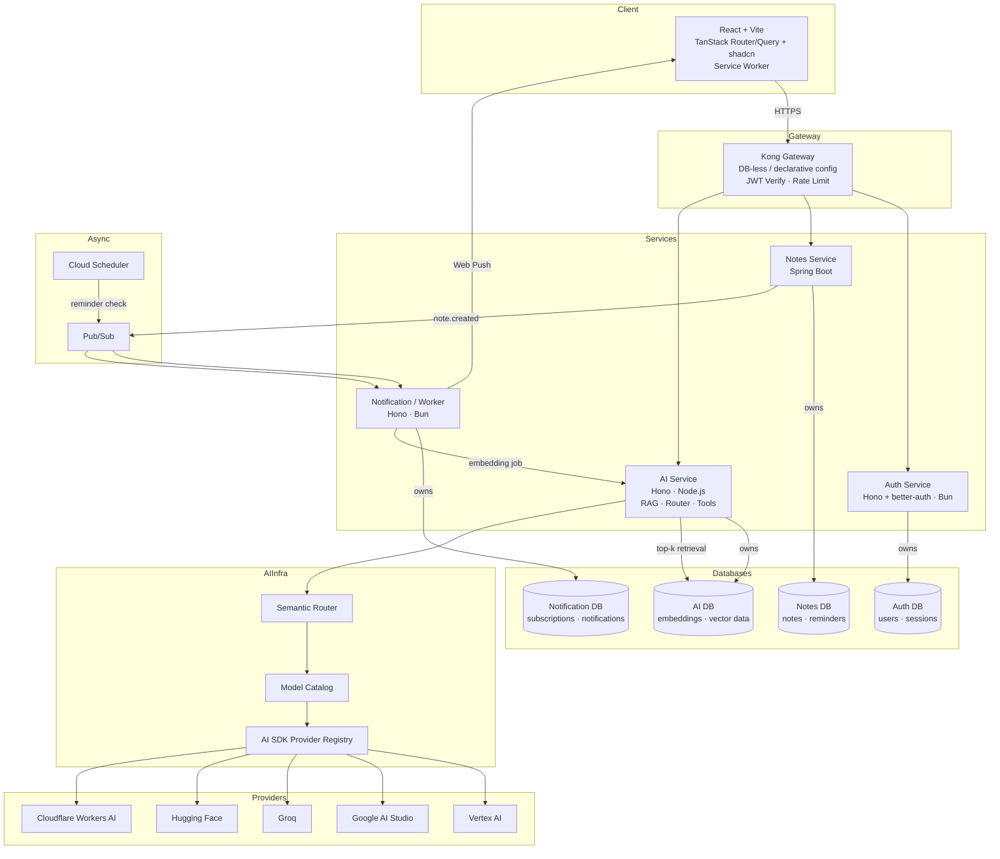
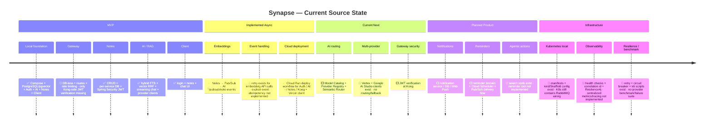

<a id="readme-top"></a>

<div align="center">

[![Contributors][contributors-shield]][contributors-url]
[![Forks][forks-shield]][forks-url]
[![Stargazers][stars-shield]][stars-url]
[![Issues][issues-shield]][issues-url]
[![MIT License][license-shield]][license-url]

[![Bun][bun-shield]][bun-url]
[![Node.js][node-shield]][node-url]
[![Hono][hono-shield]][hono-url]
[![Spring Boot][spring-shield]][spring-url]
[![React][react-shield]][react-url]
[![Vite][vite-shield]][vite-url]
[![TanStack Query][tanstack-shield]][tanstack-url]
[![Kong][kong-shield]][kong-url]
[![PostgreSQL][postgres-shield]][postgres-url]
[![pgvector][pgvector-shield]][pgvector-url]
[![Kubernetes][k8s-shield]][k8s-url]
[![Skaffold][skaffold-shield]][skaffold-url]
[![Google Pub/Sub][pubsub-shield]][pubsub-url]
[![Cloud Scheduler][scheduler-shield]][scheduler-url]
[![Google Cloud][gcp-shield]][gcp-url]

</div>

<br />
<div align="center">
  <h3 align="center">🧠 Synapse</h3>

  <p align="center">
    An AI-powered personal knowledge assistant - capture notes, chat with them via RAG, and let agentic tools handle reminders for you.
    <br />
    <a href="https://github.com/nbnguyen75/Synapse"><strong>Explore the docs »</strong></a>
    <br />
    <br />
    <a href="https://try-synapse-vault.vercel.app">View Demo</a>
    ·
    <a href="https://github.com/nbnguyen75/Synapse/issues/new?labels=bug&template=bug-report---.md">Report Bug</a>
    ·
    <a href="https://github.com/nbnguyen75/Synapse/issues/new?labels=enhancement&template=feature-request---.md">Request Feature</a>
  </p>
</div>

<details>
  <summary>Table of Contents</summary>
  <ol>
    <li>
      <a href="#about-the-project">About The Project</a>
      <ul>
        <li><a href="#built-with">Built With</a></li>
      </ul>
    </li>
    <li><a href="#architecture">Architecture</a></li>
    <li><a href="#ai-service-architecture">AI Service Architecture</a></li>
    <li><a href="#notification-architecture">Notification Architecture</a></li>
    <li>
      <a href="#getting-started">Getting Started</a>
      <ul>
        <li><a href="#prerequisites">Prerequisites</a></li>
        <li><a href="#installation">Installation</a></li>
      </ul>
    </li>
    <li><a href="#usage">Usage</a></li>
    <li><a href="#timeline">Timeline</a></li>
    <li><a href="#architecture-decision-records">Architecture Decision Records</a></li>
    <li><a href="#roadmap">Roadmap</a></li>
    <li><a href="#contributing">Contributing</a></li>
    <li><a href="#license">License</a></li>
    <li><a href="#acknowledgments">Acknowledgments</a></li>
  </ol>
</details>

## About The Project

**Synapse** is a personal knowledge assistant that turns notes into a queryable knowledge base. Users create notes, the system generates embeddings for retrieval, and the AI service answers questions using RAG. The system is designed as a small polyglot microservices showcase with clear boundaries between product features, AI infrastructure, and asynchronous work.

### MVP scope

The MVP focuses on the core path:

```text
Login
  ↓
Create / manage notes
  ↓
Generate embeddings
  ↓
Ask questions about personal notes
  ↓
Retrieve relevant notes
  ↓
Generate a grounded AI answer
```

The reminder and notification flow is a follow-up feature built on top of the same service boundaries.

| Component | Stack | Responsibility |
|---|---|---|
| Auth | Hono + better-auth on **Bun** | Authentication and user identity |
| Notes | **Java Spring Boot** | Note and reminder domain APIs + PostgreSQL persistence |
| AI Service | Hono on **Node.js** | RAG, AI model routing, streaming, generation and tools |
| Notification/Worker | Hono on **Bun** | Asynchronous embedding/notification work |
| Gateway | **Kong** | Edge routing, JWT verification and rate limiting |
| Client | React + Vite + TanStack Router/Query + shadcn | User interface and Service Worker |
| Database | PostgreSQL + **pgvector** | Persistent relational data + vector search |
| Async | **Pub/Sub** | Decoupled background/event delivery |
| Scheduler | **Cloud Scheduler** | Time-based reminder trigger |

The same service boundaries can run locally with Docker Compose or Kubernetes + Skaffold, then be deployed independently to Cloud Run.
<p align="right">(<a href="#readme-top">back to top</a>)</p>

### Built With

* [![Bun][bun-shield]][bun-url]
* [![Node.js][node-shield]][node-url]
* [![Hono][hono-shield]][hono-url]
* [![Spring Boot][spring-shield]][spring-url]
* [![React][react-shield]][react-url]
* [![Vite][vite-shield]][vite-url]
* [![TanStack Query][tanstack-shield]][tanstack-url]
* [![Kong][kong-shield]][kong-url]
* [![PostgreSQL][postgres-shield]][postgres-url]
* [![pgvector][pgvector-shield]][pgvector-url]
* [![Kubernetes][k8s-shield]][k8s-url]
* [![Skaffold][skaffold-shield]][skaffold-url]
* [![Google Pub/Sub][pubsub-shield]][pubsub-url]
* [![Cloud Scheduler][scheduler-shield]][scheduler-url]
* [![Google Cloud][gcp-shield]][gcp-url]

<p align="right">(<a href="#readme-top">back to top</a>)</p>

## Architecture

> This diagram describes the target showcase architecture. Each service owns its own data boundary. A local PostgreSQL deployment may use one PostgreSQL server/container with separate logical databases, while the service ownership remains separate.


```mermaid
flowchart TB
    subgraph Client
        UI["React + Vite<br/>TanStack Router/Query + shadcn<br/>Service Worker"]
    end

    subgraph Gateway
        KONG["Kong Gateway<br/>DB-less / declarative config<br/>JWT Verify · Rate Limit"]
    end

    subgraph Services
        AUTH["Auth Service<br/>Hono + better-auth · Bun"]
        NOTES["Notes Service<br/>Spring Boot"]
        AI["AI Service<br/>Hono · Node.js<br/>RAG · Router · Tools"]
        WORKER["Notification / Worker<br/>Hono · Bun"]
    end

    subgraph Databases
        AUTHDB[("Auth DB<br/>users · sessions")]
        NOTESDB[("Notes DB<br/>notes · reminders")]
        AIDB[("AI DB<br/>embeddings · vector data")]
        NOTIFYDB[("Notification DB<br/>subscriptions · notifications")]
    end

    subgraph AIInfra
        ROUTER["Semantic Router"]
        CATALOG["Model Catalog"]
        REGISTRY["AI SDK Provider Registry"]
    end

    subgraph Providers
        VERTEX["Vertex AI"]
        AISTUDIO["Google AI Studio"]
        GROQ["Groq"]
        HF["Hugging Face"]
        CF["Cloudflare Workers AI"]
    end

    subgraph Async
        PUBSUB["Pub/Sub"]
        SCHED["Cloud Scheduler"]
    end

    UI -->|HTTPS| KONG
    KONG --> AUTH
    KONG --> NOTES
    KONG --> AI

    AUTH -->|owns| AUTHDB
    NOTES -->|owns| NOTESDB
    AI -->|owns| AIDB
    WORKER -->|owns| NOTIFYDB

    NOTES -->|"note.created"| PUBSUB
    PUBSUB --> WORKER
    WORKER -->|embedding job| AI

    AI -->|top-k retrieval| AIDB
    AI --> ROUTER
    ROUTER --> CATALOG
    CATALOG --> REGISTRY

    REGISTRY --> VERTEX
    REGISTRY --> AISTUDIO
    REGISTRY --> GROQ
    REGISTRY --> HF
    REGISTRY --> CF

    SCHED -->|"reminder check"| PUBSUB
    PUBSUB --> WORKER
    WORKER -->|"Web Push"| UI
```

### Architecture at a glance

| Layer | What it does |
|---|---|
| **Client** | Authentication UI, notes, chat, notification center and Service Worker |
| **Kong** | Single entry point; DB-less declarative routing, request routing and lightweight local rate limiting |
| **Auth Service** | Owns authentication and user identity data |
| **Notes Service** | Owns notes/reminders and the Notes database |
| **AI Service** | Owns retrieval, embeddings, model selection, streaming, generation and AI tools |
| **Notification/Worker** | Owns notification subscriptions/state and handles asynchronous delivery |
| **Auth DB** | Data owned by Auth Service |
| **Notes DB** | Data owned by Notes Service |
| **AI DB** | Embeddings/vector data owned by AI Service |
| **Notification DB** | Notification/subscription data owned by Notification/Worker |
| **Semantic Router** | Chooses a logical model based on request characteristics |
| **Model Catalog** | Describes supported logical models/capabilities |
| **Provider Registry** | Resolves logical models to AI SDK `LanguageModel` instances |
| **Providers** | Connect external model platforms without leaking provider details into feature code |
| **Pub/Sub** | Async boundary between producers and background consumers |
| **Cloud Scheduler** | Wakes the reminder flow at the required time |

**Database ownership rule:**

```text
Auth Service
   └── Auth DB

Notes Service
   └── Notes DB

AI Service
   └── AI DB
       └── pgvector

Notification/Worker
   └── Notification DB
```

For local development, these databases can still run inside one PostgreSQL server/container to keep setup lightweight:

```text
PostgreSQL container
├── auth_db
├── notes_db
├── ai_db
└── notification_db
```

The important boundary is **logical ownership**, not the number of PostgreSQL processes.

**Request flow (RAG chat example):**

1. The client sends a request through **Kong**.
2. **AI Service** verifies the JWT locally using cached JWKS key material.
3. **AI Service** retrieves the most relevant embeddings/notes from its own database.
3. **Semantic Router** chooses a logical model.
4. **Model Catalog** and **Provider Registry** resolve that model to an AI SDK `LanguageModel`.
5. `streamText()` generates the answer.
6. The response is streamed back to the client.

**Asynchronous flow:**

```text
note.created
   ↓
Pub/Sub
   ↓
Worker
   ↓
AI embedding path
   ↓
AI DB / pgvector
```

**Reminder flow:**

```text
Cloud Scheduler
   ↓
reminder check
   ↓
Pub/Sub
   ↓
Notification Worker
   ├─ Notification DB
   └─ Web Push
```

<p align="right">(<a href="#readme-top">back to top</a>)</p>

## AI Service Architecture

The AI service keeps **provider integration**, **model selection**, and **product features** separate:

```text
providers/
    provider SDK initialization

ai/
    model catalog + registry + semantic routing

chat/ · generator/ · embeddings/
    product-specific AI behavior
```

Recommended structure:

```text
services/ai/src/
├── ai/
│   ├── catalog.ts
│   ├── registry.ts
│   ├── types.ts
│   └── router/
│       ├── semantic.ts
│       ├── policy.ts
│       └── index.ts
├── providers/
├── chat/
├── embeddings/
├── generator/
├── conversation/
├── database/
├── lib/
├── middleware/
├── config/
├── settings/
├── types/
├── app.ts
└── index.ts
```

The intended dependency direction is:

```text
chat
  ↓
semantic router
  ↓
model catalog
  ↓
provider registry
  ↓
LanguageModel
```

`chat/services.ts` should not import a concrete provider model.

### Authentication and JWKS

The AI service uses `jose` with a module-level `createRemoteJWKSet()`.

```ts
const JWKS = createRemoteJWKSet(new URL(env.AUTH_JWKS_URL));

await jwtVerify(token, JWKS, {
    audience: env.PUBLIC_APP_NAME,
    issuer: env.PUBLIC_APP_NAME,
});
```

This means the service does **not** need to call the Auth service for every request.

The public JWKS endpoint is fetched when the local JWKS cache needs it; JWT signature verification then happens locally inside the AI process.


The Notes service follows the same architectural model through Spring Security OAuth2 Resource Server: fetch the issuer's JWKS, cache the key material, then verify JWTs locally.

A useful operational consequence is:

```text
Auth service temporarily unavailable
        ↓
existing signing keys already cached
        ↓
Notes / AI can continue verifying matching JWTs
```

A new signing key still requires a successful JWKS refresh before tokens signed only by that key can be accepted.

### Routing

The first router is deterministic rather than LLM-based:

```text
prompt
  ↓
complexity / capability signals
  ↓
routing policy
  ↓
logical model id
```

This avoids an extra inference call just to select another model.

### RAG and embeddings

The AI service owns retrieval and vector data.

```text
note
  ↓
embedding
  ↓
AI DB / pgvector
  ↓
top-k retrieval
  ↓
prompt context
  ↓
selected language model
```

Embedding selection remains separate from chat model routing because embeddings and generation have different interfaces and responsibilities.

<p align="right">(<a href="#readme-top">back to top</a>)</p>

## Notification Architecture

Notifications use a simple asynchronous path:

```text
Cloud Scheduler
      ↓
reminder check
      ↓
Pub/Sub
      ↓
Notification Worker
      ├─ persist notification (is_read=false)
      └─ send Web Push
```

The notification table is the durable unread state:

| Column | Purpose |
|---|---|
| `id` | Primary key |
| `user_id` | Owner |
| `title`, `body` | Display content |
| `type` | `reminder`, `system`, etc. |
| `is_read` | Read/unread state |
| `created_at` | Creation time |

Client:

```text
open app
   ↓
GET /notifications?unread=true
   ↓
show unread badge/list
   ↓
PATCH /notifications/:id/read
```

There is no SSE, WebSocket, or continuous polling requirement for the reminder/notification path.
<p align="right">(<a href="#readme-top">back to top</a>)</p>

## Getting Started

Synapse is designed to be runnable locally before any cloud deployment.

### Prerequisites

* [Bun](https://bun.sh/)
```sh
  curl -fsSL https://bun.sh/install | bash
```
* Node.js (LTS)
* Java 21+ and Maven/Gradle
* Docker & Docker Compose
* [kind](https://kind.sigs.k8s.io/) for local Kubernetes
* [Skaffold](https://skaffold.dev/) for local Kubernetes development

### Installation

1. Clone the repo
```sh
   git clone https://github.com/nbnguyen75/Synapse.git
   cd Synapse
```

2. Configure environment variables
```sh
   cp .env.example .env
   # set the variables required by the current services
```

3. Install dependencies
```sh
   cd services/auth && bun install
   cd ../ai && npm install
   cd ../notes && ./mvnw install
   cd ../../client && npm install
   cd ../..
```

### Run locally with Docker Compose

Use this as the simplest local path for the core application and PostgreSQL + pgvector:

```sh
docker compose up -d
```

Then start the application services with their existing development commands.

Minimum smoke test:

```text
login
  → create note
  → embedding
  → ask a question
  → retrieve relevant note
  → receive grounded AI answer
```

### Run locally with Kubernetes + Skaffold

Use this path when you want to exercise the service-to-service Kubernetes architecture locally.

1. Create a local cluster:
```sh
kind create cluster --name synapse
```

2. Start the development loop:
```sh
skaffold dev
```

Or build/deploy once:

```sh
skaffold run
```

The Kubernetes manifests should provide the same service boundaries as the Docker Compose environment:

```text
Auth
Notes
AI
Notification/Worker
Kong
PostgreSQL / pgvector
```

Use Docker Compose when you only need the application quickly. Use Skaffold + kind when you want to test Kubernetes service discovery, manifests, ingress/gateway behavior and container-to-container networking.

### Cloud deployment

Cloud deployment is a separate step:

```text
Cloud Run
  ├─ Auth
  ├─ Notes
  ├─ AI
  └─ Worker

PostgreSQL + pgvector
Pub/Sub
Cloud Scheduler
```

Cloud components are not required to develop the core RAG flow locally.
<p align="right">(<a href="#readme-top">back to top</a>)</p>

## Usage

### MVP

The MVP demonstrates:

```text
Auth
  ↓
Notes CRUD
  ↓
Embedding + pgvector
  ↓
RAG chat
  ↓
Streaming AI response
```

The main demo question should be grounded in notes that the user has actually created.

### Next features

The next additions build on the same boundaries:

```text
Semantic Router
  ↓
Multi-provider model catalog
  ↓
Retry / fallback
  ↓
Event-driven embeddings
  ↓
Reminder + Web Push
  ↓
Cloud Scheduler + Pub/Sub
  ↓
Cloud Run deployment
```

The demo should make the architectural reason visible, not just the feature itself:

```text
"Why is this model selected?"
"Why is this work asynchronous?"
"Why does the reminder need a scheduler?"
```
<p align="right">(<a href="#readme-top">back to top</a>)</p>

<p align="right">(<a href="#readme-top">back to top</a>)</p>


## Timeline

> `✅` = implementation is present in the source tree.  
> `🚧` = partially implemented or the source contains an inconsistency.  
> `⬜` = not implemented in the current source.  
> This scan does not claim a live local/cloud execution; runtime verification is marked separately when the source cannot prove it.

The timeline below reflects the repository **as it exists now**, not the older roadmap.


```mermaid
timeline
    title Synapse — Current Source State

    section MVP
        Local foundation : ✅ Compose + PostgreSQL/pgvector + Auth + AI + Notes + Client
        Gateway : 🚧 DB-less + routes + rate limiting · only Kong-side JWT verification missing
        Notes : ✅ CRUD + per-service DB + Spring Security JWT
        AI / RAG : ✅ hybrid FTS + vector RRF + streaming chat + provider clients
        Client : ✅ login + notes + chat UI

    section Implemented Async
        Embeddings : ✅ Notes → Pub/Sub → AI `/pubsub/note-events`
        Event handling : 🚧 retry exists for embedding API calls · explicit event idempotency not implemented
        Cloud deployment : ✅ Cloud Run deploy workflow for Auth / AI / Notes / Kong + Vercel client

    section Current Next
        AI routing : ⬜ Model Catalog + Provider Registry + Semantic Router
        Multi-provider : 🚧 Vertex + Google AI Studio clients exist · no routing/fallback
        Gateway security : ⬜ JWT verification at Kong

    section Planned Product
        Notifications : ⬜ notification service / DB / Web Push
        Reminders : ⬜ reminder domain + Cloud Scheduler + Pub/Sub delivery flow
        Agentic actions : 🚧 search tools exist · reminder tool not implemented

    section Infrastructure
        Kubernetes local : 🚧 manifests + kind/Skaffold config exist · K8s still contains RabbitMQ wiring
        Observability : 🚧 health checks + correlation id + Resilience4j · centralized metrics/tracing not implemented
        Resilience / benchmark : 🚧 retry + circuit breaker + k6 scripts exist · no provider benchmark/failure suite
```

### 🏗️ Epic 0.1: Local Foundation
**Status:** ✅ Done (source)

- [x] Monorepo structure
- [x] Docker Compose baseline
- [x] PostgreSQL + pgvector
- [x] Auth service scaffold
- [x] AI service scaffold
- [x] Notes service scaffold
- [x] Client scaffold
- [ ] Live `docker compose up -d` verification from this source scan

**Current local stack in `compose.yml`:**

```text
PostgreSQL + pgvector
Pub/Sub emulator
Auth
AI
Notes
Kong
```

---

### 🚪 Epic 0.2: Kong Gateway
**Status:** 🚧 Partial

- [x] Kong DB-less / declarative configuration
- [x] Auth route
- [x] Notes route
- [x] AI route
- [x] Local rate limiting
- [x] Correlation ID
- [ ] JWT verification inside Kong

Gateway-level JWT verification is the **only missing part** of the current security path.

The current architecture already verifies JWTs inside the downstream services:

```text
Client
  ↓
Kong
  ├─ routing
  └─ rate limiting
       ↓
Notes / AI
  ↓
JWT verification at service
  ↓
JWKS fetched from Auth
  ↓
local verification
```

**Exit:**

```text
Client → Kong → Auth / Notes / AI
             ↓
      service-level JWT verification
```

---

---

### 📝 Epic 0.3: Notes Service
**Status:** 🚧 Partial

- [x] Spring Boot service
- [x] Note entity + repository
- [x] Create / Read / List / Update / Delete
- [x] Pagination / filtering / bulk actions
- [x] Notes database ownership (`notes_db`)
- [x] JWT resource-server security
- [ ] Reminder model
- [ ] Live runtime verification

The current `Note` domain contains note lifecycle state (`active`, `archived`, `trashed`, `favorite`, `pinned`) but **no reminder entity/domain model exists yet**.

---

### 💻 Epic 0.4: React Client
**Status:** ✅ Done (source)

- [x] Login / register UI
- [x] Notes list
- [x] Create / edit / archive / trash / restore note flows
- [x] Chat UI
- [x] Conversation/message tree handling
- [x] Client-side authentication and JWT token flow
- [x] Client API layer
- [ ] Final end-to-end runtime verification from this source scan

The client feature inventory currently contains **53 completed features**, with a small number explicitly deferred/not started.

---

### 🤖 Epic 1.1: AI Service + Provider Boundary
**Status:** 🚧 Partial

- [x] Provider SDK initialization under `services/ai/src/providers/`
- [x] Vertex AI provider
- [x] Google AI Studio provider
- [x] Current Vertex chat model path
- [x] Embedding model path
- [ ] `ai/catalog.ts`
- [ ] `ai/registry.ts`
- [ ] `ai/types.ts`
- [ ] Remove direct provider coupling from `chat/services.ts`

**Current source reality:**

```text
chat/services.ts
    ↓
vertexGemini35FlashLite
    ↓
streamText()
```

The provider layer exists, but the abstraction layer discussed in the architecture has not been implemented yet.

---

### 🧠 Epic 1.2: Semantic Router
**Status:** ⬜ Not Started

- [ ] `ai/router/semantic.ts`
- [ ] `ai/router/policy.ts`
- [ ] `fast / balanced / reasoning`
- [ ] Deterministic complexity scoring
- [ ] Capability/tool routing
- [ ] Logical `modelId`
- [ ] Registry-based model resolution
- [ ] Router tests

---

### 🔎 Epic 1.3: RAG + Embeddings
**Status:** ✅ Done (source)

- [x] Embedding generation
- [x] 768-dimension vector storage
- [x] AI database (`ai_db`)
- [x] pgvector HNSW index
- [x] Full-text search
- [x] Vector similarity search
- [x] Hybrid RRF retrieval
- [x] Top-k retrieval
- [x] Tool-based note retrieval
- [x] Conversation history retrieval
- [x] Streaming AI response
- [x] Retry for embedding API 429 responses
- [ ] Re-run full end-to-end runtime verification

The current RAG implementation is already beyond the original basic plan:

```text
FTS fast path
   ↓ (if insufficient results)
query embedding
   ↓
vector search + FTS
   ↓
Reciprocal Rank Fusion
   ↓
top-k notes
   ↓
AI tool / response generation
```

---

### 🔁 Epic 1.4: Multi-Provider + Fallback
**Status:** 🚧 Partial

- [x] Vertex provider client
- [x] Google AI Studio provider client
- [ ] Provider registry
- [ ] Model catalog metadata
- [ ] Semantic routing between providers/models
- [x] Limited retry helper for rate-limit errors
- [ ] Cross-provider fallback chain
- [ ] Provider failure test suite

There are already **two Google model integrations**, but the application currently selects the Vertex model directly.

---

### 📬 Epic 2.1: Event-Driven Embeddings
**Status:** 🚧 Partial → functionally implemented in local Compose

- [x] Define `note.created`
- [x] Define `note.updated`
- [x] Define `note.deleted`
- [x] Notes publishes events after transaction commit
- [x] Local Pub/Sub emulator
- [x] Pub/Sub topic/subscription initialization
- [x] AI `/pubsub/note-events` consumer
- [x] Upsert note mirror in AI DB
- [x] Generate embeddings for changed notes
- [x] Delete stale embeddings for trashed/deleted notes
- [x] Retry embedding API rate-limit failures
- [ ] Explicit Pub/Sub event idempotency strategy
- [ ] Kubernetes environment aligned to the same Pub/Sub flow
- [ ] Live event-flow verification

**Actual current flow:**

```text
Notes Service
   ↓
Pub/Sub
   ↓
AI Service `/pubsub/note-events`
   ↓
AI DB
   ├─ notes mirror
   └─ note_embeddings
```

There is **no separate Worker service** in the current source for embeddings; AI consumes the Pub/Sub event itself.

---

### 🔔 Epic 2.2: Notifications + Web Push
**Status:** ⬜ Not Started

- [ ] Notification service
- [ ] Notification database
- [ ] Push subscription storage
- [ ] `/push-handler`
- [ ] `/notifications?unread=true`
- [ ] Mark-read endpoint
- [ ] Service Worker push handling

The current repository has notification-related UI/settings references, but no notification backend, Web Push implementation, or persistent notification model.

---

### ⏰ Epic 2.3: Reminder Scheduling
**Status:** ⬜ Not Started

- [ ] Reminder domain model
- [ ] Reminder creation tool
- [ ] Reminder due-date query/check
- [ ] Cloud Scheduler job
- [ ] Pub/Sub reminder event
- [ ] Notification Worker
- [ ] Web Push delivery
- [ ] Idempotency / duplicate protection

Cloud Scheduler is **not present in the current repository source**.

---

### ☁️ Epic 3.1: Cloud Deployment
**Status:** ✅ Done (deployment source)

- [x] Dockerfiles for Auth / AI / Notes / Kong
- [x] Artifact Registry build/push workflow
- [x] Cloud Run deployment for Auth
- [x] Cloud Run deployment for AI
- [x] Cloud Run deployment for Notes
- [x] Cloud Run deployment for Kong gateway
- [x] Vercel client deployment
- [x] Runtime secrets supplied through deployment workflow
- [x] `min-instances: 0` for current Cloud Run services
- [ ] Separate Notification/Worker deployment
- [ ] Cloud service-to-service authenticated invocation
- [ ] Live deployment verification in this source scan

---

### ☸️ Epic 3.2: Kubernetes Local with kind + Skaffold
**Status:** 🚧 Partial

- [x] kind-oriented manifests
- [x] Deployment manifests
- [x] Service manifests
- [x] ConfigMap / Secret generation
- [x] Kong deployment
- [x] PostgreSQL deployment
- [x] Separate logical databases (`auth_db`, `notes_db`, `ai_db`)
- [x] Skaffold configuration
- [x] Local port-forward configuration
- [x] Kubernetes service discovery structure
- [ ] Full cluster/runtime verification
- [ ] Notification/Worker deployment
- [ ] Pub/Sub emulator deployment/configuration in the K8s environment
- [ ] Remove/replace stale RabbitMQ wiring

**Important source mismatch:**

```text
Current application event flow:
Notes → Pub/Sub → AI

Current K8s manifests:
Notes / AI → wait-for-rabbitmq
```

RabbitMQ manifests still exist under `infra/k8s/base/`, but the current Notes/AI application code uses Google Pub/Sub for note events. This needs cleanup before calling the Kubernetes architecture complete.

---

### 📊 Epic 4.1: Observability
**Status:** 🚧 Partial

- [x] Health endpoint in Auth
- [x] Health endpoint in AI
- [x] Spring Actuator health in Notes
- [x] Kong correlation ID
- [x] Application/service error logging
- [x] Spring logging configuration
- [ ] Structured logging standard across all services
- [ ] Centralized metrics
- [ ] Distributed tracing
- [ ] Cloud Monitoring dashboards
- [ ] AI routing metrics
- [ ] Worker event metrics

---

### 🧰 Epic 4.2: Agentic Tools
**Status:** 🚧 Partial

- [x] `searchNotes`
- [x] `searchChatHistories`
- [x] `searchWeb`
- [x] Tool schemas / validation
- [x] Multi-step tool execution support (`stopWhen: isStepCount(5)`)
- [ ] Create reminder tool
- [ ] Tool authorization policy beyond user-scoped data/tool construction
- [ ] Full reminder workflow

The agentic foundation already exists, but the reminder action described by the future architecture does not.

---

### 🧪 Epic 5.1: Resilience + Benchmark
**Status:** 🚧 Partial

- [x] AI retry helper for 429 rate-limit errors
- [x] Notes → AI circuit breaker
- [x] Notes → AI timeout protection
- [x] k6 smoke tests for Auth
- [x] k6 smoke tests for Notes
- [x] k6 smoke tests through Kong
- [ ] Provider failure/fallback test suite
- [ ] Rate-limit behavior test suite
- [ ] Worker retry/idempotency tests
- [ ] Multi-provider benchmark
- [ ] Cost/latency comparison report

---

### 📌 Current Next Step

**First priority:**

```text
ai/catalog.ts
    ↓
ai/registry.ts
    ↓
ai/router/semantic.ts
    ↓
refactor chat/services.ts
```

After that:

```text
multi-provider fallback
    ↓
clean K8s RabbitMQ leftovers
    ↓
notifications / reminder domain
    ↓
Scheduler + Pub/Sub reminder flow
```

<p align="right">(<a href="#readme-top">back to top</a>)</p>

## Architecture Decision Records

<details>
<summary><strong>ADR-0001 — Kong DB-less</strong></summary>

**Status:** Accepted

Kong uses DB-less declarative configuration for the MVP. Routing and local rate limiting stay at the edge; JWT verification remains in the downstream services until gateway-level JWT verification is explicitly added.

</details>

<details>
<summary><strong>ADR-0002 — JWT Verification at the Resource Service</strong></summary>

**Status:** Accepted

Notes and AI verify JWTs in the resource service itself.

```text
request
  ↓
resource service
  ↓
JWKS cache
  ↓
local JWT signature verification
```

The Auth service is the issuer/JWKS authority, not a dependency for every authenticated request.

The AI service uses `jose.createRemoteJWKSet()`. Spring Security OAuth2 Resource Server provides the equivalent model in Notes.

The JWKS cache is process-local and does not require an external cache.

**Why:** resource servers can continue verifying tokens while the Auth service is temporarily unavailable, as long as the required signing key is already cached.

**Trade-off:** each application instance maintains its own JWKS cache, and a newly rotated key requires a successful JWKS refresh before tokens using that key can be verified.

</details>

<details>
<summary><strong>ADR-0003 — Cloud Scheduler + Pub/Sub for Reminders</strong></summary>

**Status:** Accepted

**Context:** Reminders are time-based and should not require a long-lived client/server connection.

**Decision:**

```text
Cloud Scheduler
  ↓
reminder check
  ↓
Pub/Sub
  ↓
Notification Worker
  ↓
Web Push
```

**Why:** The time trigger, asynchronous delivery and retryable work are cleanly separated.

**Local rule:** The reminder-check operation remains manually callable so local development does not depend on Cloud Scheduler.

</details>

<details>
<summary><strong>ADR-0004 — Docker Compose + kind/Skaffold for Local Development</strong></summary>

**Status:** Accepted

**Decision:** Support two local paths.

```text
Docker Compose
→ fastest application/infrastructure loop

kind + Skaffold
→ Kubernetes networking, manifests, gateway and service-discovery validation
```

Both paths represent the same logical service boundaries.

</details>

<p align="right">(<a href="#readme-top">back to top</a>)</p>

## Roadmap

The current state and next steps are maintained in the Timeline above. The Timeline is synchronized to the latest scanned source tree.


## Contributing

Contributions are welcome.

1. Fork the Project
2. Create your Feature Branch (`git checkout -b feature/AmazingFeature`)
3. Commit your Changes (`git commit -m 'Add some AmazingFeature'`)
4. Push to the Branch
5. Open a Pull Request

<p align="right">(<a href="#readme-top">back to top</a>)</p>

## License

Distributed under the MIT License. See `LICENSE.txt` for more information.

<p align="right">(<a href="#readme-top">back to top</a>)</p>

## Contact

<!-- Your Name - [@twitter_handle](https://twitter.com/twitter_handle) - email@email_client.com -->

Project Link: [https://github.com/nbnguyen75/Synapse](https://github.com/nbnguyen75/Synapse)

<p align="right">(<a href="#readme-top">back to top</a>)</p>

## Acknowledgments

* [Best-README-Template](https://github.com/othneildrew/Best-README-Template)
* [Vercel AI SDK](https://sdk.vercel.ai/)
* [pgvector](https://github.com/pgvector/pgvector)

<p align="right">(<a href="#readme-top">back to top</a>)</p>

<!-- MARKDOWN LINKS & IMAGES -->
[contributors-shield]: https://img.shields.io/github/contributors/nbnguyen75/Synapse.svg?style=for-the-badge
[contributors-url]: https://github.com/nbnguyen75/Synapse/graphs/contributors
[forks-shield]: https://img.shields.io/github/forks/nbnguyen75/Synapse.svg?style=for-the-badge
[forks-url]: https://github.com/nbnguyen75/Synapse/network/members
[stars-shield]: https://img.shields.io/github/stars/nbnguyen75/Synapse.svg?style=for-the-badge
[stars-url]: https://github.com/nbnguyen75/Synapse/stargazers
[issues-shield]: https://img.shields.io/github/issues/nbnguyen75/Synapse.svg?style=for-the-badge
[issues-url]: https://github.com/nbnguyen75/Synapse/issues
[license-shield]: https://img.shields.io/github/license/nbnguyen75/Synapse.svg?style=for-the-badge
[license-url]: https://github.com/nbnguyen75/Synapse/blob/main/LICENSE.txt

[bun-shield]: https://img.shields.io/badge/Bun-000000?style=for-the-badge&logo=bun&logoColor=white
[bun-url]: https://bun.sh/
[node-shield]: https://img.shields.io/badge/Node.js-339933?style=for-the-badge&logo=nodedotjs&logoColor=white
[node-url]: https://nodejs.org/
[hono-shield]: https://img.shields.io/badge/Hono-E36002?style=for-the-badge&logo=hono&logoColor=white
[hono-url]: https://hono.dev/
[spring-shield]: https://img.shields.io/badge/Spring_Boot-6DB33F?style=for-the-badge&logo=springboot&logoColor=white
[spring-url]: https://spring.io/projects/spring-boot
[react-shield]: https://img.shields.io/badge/React-20232A?style=for-the-badge&logo=react&logoColor=61DAFB
[react-url]: https://react.dev/
[vite-shield]: https://img.shields.io/badge/Vite-646CFF?style=for-the-badge&logo=vite&logoColor=white
[vite-url]: https://vitejs.dev/
[tanstack-shield]: https://img.shields.io/badge/TanStack_Query-FF4154?style=for-the-badge&logo=reactquery&logoColor=white
[tanstack-url]: https://tanstack.com/query
[kong-shield]: https://img.shields.io/badge/Kong-003459?style=for-the-badge&logo=kong&logoColor=white
[kong-url]: https://konghq.com/
[postgres-shield]: https://img.shields.io/badge/PostgreSQL-4169E1?style=for-the-badge&logo=postgresql&logoColor=white
[postgres-url]: https://www.postgresql.org/
[pgvector-shield]: https://img.shields.io/badge/pgvector-4169E1?style=for-the-badge&logo=postgresql&logoColor=white
[pgvector-url]: https://github.com/pgvector/pgvector
[k8s-shield]: https://img.shields.io/badge/Kubernetes-326CE5?style=for-the-badge&logo=kubernetes&logoColor=white
[k8s-url]: https://kubernetes.io/
[skaffold-shield]: https://img.shields.io/badge/Skaffold-64B5F6?style=for-the-badge&logo=googlecloud&logoColor=white
[skaffold-url]: https://skaffold.dev/
[pubsub-shield]: https://img.shields.io/badge/Google%20Pub%2FSub-4285F4?style=for-the-badge&logo=googlecloud&logoColor=white
[pubsub-url]: https://cloud.google.com/pubsub
[scheduler-shield]: https://img.shields.io/badge/Cloud%20Scheduler-4285F4?style=for-the-badge&logo=googlecloud&logoColor=white
[scheduler-url]: https://cloud.google.com/scheduler
[gcp-shield]: https://img.shields.io/badge/Google_Cloud-4285F4?style=for-the-badge&logo=googlecloud&logoColor=white
[gcp-url]: https://cloud.google.com/
