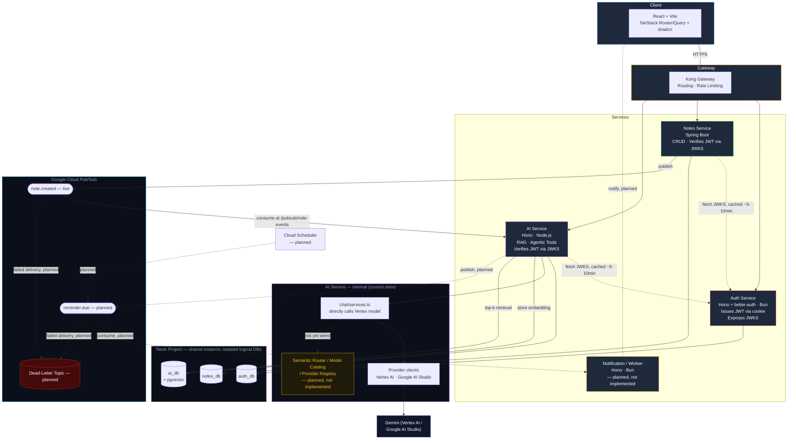

<a id="readme-top"></a>

<div align="center">

[![Contributors][contributors-shield]][contributors-url]
[![Forks][forks-shield]][forks-url]
[![Stargazers][stars-shield]][stars-url]
[![Issues][issues-shield]][issues-url]
[![MIT License][license-shield]][license-url]

[![Bun][bun-shield]][bun-url]
[![Node.js][node-shield]][node-url]
[![Hono][hono-shield]][hono-url]
[![Spring Boot][spring-shield]][spring-url]
[![React][react-shield]][react-url]
[![Vite][vite-shield]][vite-url]
[![TanStack Query][tanstack-shield]][tanstack-url]
[![Kong][kong-shield]][kong-url]
[![Neon][neon-shield]][neon-url]
[![pgvector][pgvector-shield]][pgvector-url]
[![Google Pub/Sub][pubsub-shield]][pubsub-url]
[![Cloud Scheduler][scheduler-shield]][scheduler-url]
[![Cloud Run][cloudrun-shield]][cloudrun-url]

</div>

<br />
<div align="center">
  <h3 align="center">🧠 Synapse</h3>

  <p align="center">
    An AI-powered personal knowledge assistant - capture notes, chat with them via RAG, and let agentic tools handle reminders for you.
    <br />
    <a href="https://github.com/nbnguyen75/Synapse"><strong>Explore the docs »</strong></a>
    <br />
    <br />
    <a href="https://try-synapse-vault.vercel.app">View Demo</a>
    ·
    <a href="https://github.com/nbnguyen75/Synapse/issues/new?labels=bug&template=bug-report---.md">Report Bug</a>
    ·
    <a href="https://github.com/nbnguyen75/Synapse/issues/new?labels=enhancement&template=feature-request---.md">Request Feature</a>
  </p>
</div>

<details>
  <summary>Table of Contents</summary>
  <ol>
    <li>
      <a href="#about-the-project">About The Project</a>
      <ul>
        <li><a href="#built-with">Built With</a></li>
      </ul>
    </li>
    <li><a href="#architecture">Architecture</a></li>
    <li><a href="#ai-service-architecture">AI Service Architecture</a></li>
    <li><a href="#notification-architecture-planned">Notification Architecture (Planned)</a></li>
    <li>
      <a href="#getting-started">Getting Started</a>
      <ul>
        <li><a href="#prerequisites">Prerequisites</a></li>
        <li><a href="#installation">Installation</a></li>
      </ul>
    </li>
    <li><a href="#usage">Usage</a></li>
    <li><a href="#architecture-decision-records">Architecture Decision Records</a></li>
    <li><a href="#roadmap">Roadmap</a></li>
    <li><a href="#contributing">Contributing</a></li>
    <li><a href="#license">License</a></li>
    <li><a href="#acknowledgments">Acknowledgments</a></li>
  </ol>
</details>

## About The Project

**Synapse** is a personal knowledge assistant that turns notes into a queryable knowledge base. Users create notes, the system generates embeddings for retrieval, and the AI service answers questions using RAG. The system is a small polyglot microservices showcase with clear boundaries between product features, AI infrastructure, and asynchronous work — each service owns its own runtime, its own database, and its own reason for existing.

### MVP scope

The MVP covers the core path:

```text
Login
  ↓
Create / manage notes
  ↓
Generate embeddings
  ↓
Ask questions about personal notes
  ↓
Retrieve relevant notes
  ↓
Generate a grounded AI answer
```

Reminders and notifications are a planned follow-up feature, built on the same service boundaries already in place.

| Component | Stack | Responsibility |
|---|---|---|
| Auth | Hono + better-auth on **Bun** | Authentication and user identity, JWT issuance via cookie, JWKS exposure |
| Notes | **Java Spring Boot** | Note domain APIs + PostgreSQL persistence, JWT verification via JWKS |
| AI Service | Hono on **Node.js** | RAG, embeddings, streaming generation, agentic tools, JWT verification via JWKS |
| Notification/Worker | Hono on **Bun** *(planned)* | Asynchronous reminder delivery |
| Gateway | **Kong** | Edge routing and rate limiting |
| Client | React + Vite + TanStack Router/Query + shadcn | User interface |
| Database | **Neon (serverless PostgreSQL)** + **pgvector** | Isolated logical database per service, shared Neon project |
| Async | **Google Cloud Pub/Sub** | Decoupled event delivery (`note.created` live; `reminder.due` planned) |
| Scheduler | **Cloud Scheduler** *(planned)* | Time-based reminder trigger |
| Deployment | **Google Cloud Run** | Serverless, scale-to-zero hosting for every service |

There is currently **no RBAC layer** — a valid JWT is sufficient to authorize a request, since every user only ever accesses their own data. This was a deliberate scope decision, not an oversight (see ADR-0005).

<p align="right">(<a href="#readme-top">back to top</a>)</p>

### Built With

* [![Bun][bun-shield]][bun-url]
* [![Node.js][node-shield]][node-url]
* [![Hono][hono-shield]][hono-url]
* [![Spring Boot][spring-shield]][spring-url]
* [![React][react-shield]][react-url]
* [![Vite][vite-shield]][vite-url]
* [![TanStack Query][tanstack-shield]][tanstack-url]
* [![Kong][kong-shield]][kong-url]
* [![Neon][neon-shield]][neon-url]
* [![pgvector][pgvector-shield]][pgvector-url]
* [![Google Pub/Sub][pubsub-shield]][pubsub-url]
* [![Cloud Scheduler][scheduler-shield]][scheduler-url]
* [![Cloud Run][cloudrun-shield]][cloudrun-url]

<p align="right">(<a href="#readme-top">back to top</a>)</p>

## Architecture

> This diagram reflects the **actual current source**, not an aspirational target. Dotted lines/labels marked "planned" are not implemented yet. Each service owns its own logical database; all three currently live inside a **single shared Neon project** as separate logical databases, not separate physical clusters.


```mermaid
flowchart TB
    subgraph Client
        UI["React + Vite<br/>TanStack Router/Query + shadcn"]
    end

    subgraph Gateway
        KONG["Kong Gateway<br/>Routing · Rate Limiting"]
    end

    subgraph Services
        AUTH["Auth Service<br/>Hono + better-auth · Bun<br/>Issues JWT via cookie<br/>Exposes JWKS"]
        NOTES["Notes Service<br/>Spring Boot<br/>CRUD · Verifies JWT via JWKS"]
        AI["AI Service<br/>Hono · Node.js<br/>RAG · Agentic Tools<br/>Verifies JWT via JWKS"]
        WORKER["Notification / Worker<br/>Hono · Bun<br/>— planned, not implemented"]
    end

    subgraph AIInternal["AI Service — internal (current state)"]
        direction TB
        CHAT["chat/services.ts<br/>directly calls Vertex model"]
        PROVCLIENTS["Provider clients<br/>Vertex AI · Google AI Studio"]
        ROUTERPLANNED["Semantic Router / Model Catalog<br/>/ Provider Registry<br/>— planned, not implemented"]
    end

    subgraph NeonProject["Neon Project — shared instance, isolated logical DBs"]
        direction LR
        AUTHDB[("auth_db")]
        NOTESDB[("notes_db")]
        AIDB[("ai_db<br/>+ pgvector")]
    end

    subgraph PubSubRegion["Google Cloud Pub/Sub"]
        direction LR
        TOPIC1(["note.created — live"])
        TOPIC2(["reminder.due — planned"])
        DLQ[("Dead-Letter Topic — planned")]
    end

    SCHED["Cloud Scheduler<br/>— planned"]
    GEMINI["Gemini (Vertex AI /<br/>Google AI Studio)"]

    UI -->|HTTPS| KONG
    KONG --> AUTH
    KONG --> NOTES
    KONG --> AI

    NOTES -.->|fetch JWKS, cached ~5-10min| AUTH
    AI -.->|fetch JWKS, cached ~5-10min| AUTH

    AUTH --> AUTHDB
    NOTES --> NOTESDB
    AI --> AIDB

    NOTES -->|publish| TOPIC1
    TOPIC1 -->|consume at /pubsub/note-events| AI
    AI --> CHAT
    CHAT --> PROVCLIENTS
    PROVCLIENTS --> GEMINI
    CHAT -.->|not yet wired| ROUTERPLANNED

    AI -->|store embedding| AIDB
    AI -->|top-k retrieval| AIDB

    AI -.->|publish, planned| TOPIC2
    TOPIC2 -.->|consume, planned| WORKER
    WORKER -.->|notify, planned| UI

    SCHED -.->|planned| TOPIC2
    TOPIC1 -.->|failed delivery, planned| DLQ
    TOPIC2 -.->|failed delivery, planned| DLQ

    style Client fill:#1e293b,stroke:#3b82f6,color:#fff
    style Gateway fill:#1e293b,stroke:#f59e0b,color:#fff
    style AUTH fill:#1e293b,stroke:#ef4444,color:#fff
    style NOTES fill:#1e293b,stroke:#22c55e,color:#fff
    style AI fill:#1e293b,stroke:#a855f7,color:#fff
    style WORKER fill:#1e293b,stroke:#eab308,color:#fff
    style NeonProject fill:#0a0f1a,stroke:#475569,color:#94a3b8
    style PubSubRegion fill:#0a0f1a,stroke:#0891b2,color:#94a3b8
    style AIInternal fill:#0a0f1a,stroke:#a855f7,color:#94a3b8
    style DLQ fill:#450a0a,stroke:#dc2626,color:#fff
    style GEMINI fill:#0f172a,stroke:#8b5cf6,color:#fff
    style ROUTERPLANNED fill:#1e1b0a,stroke:#eab308,color:#fbbf24
```

### Architecture at a glance

| Layer | What it does |
|---|---|
| **Client** | Login, notes management, and chat UI |
| **Kong** | Single entry point; request routing and rate limiting (JWT verification happens downstream, not at Kong — see ADR-0002) |
| **Auth Service** | Owns authentication, issues JWT via HTTP-only cookie, exposes JWKS |
| **Notes Service** | Owns notes CRUD and the Notes database; verifies JWT via JWKS |
| **AI Service** | Owns retrieval, embeddings, generation, agentic tools; verifies JWT via JWKS; currently calls the Vertex model directly (semantic router/registry planned, not wired in yet) |
| **Notification/Worker** *(planned)* | Will own reminder delivery and notification state |
| **Auth DB** | Data owned by Auth Service |
| **Notes DB** | Data owned by Notes Service |
| **AI DB** | Embeddings/vector data owned by AI Service (pgvector) |
| **Pub/Sub** | Async boundary — currently used for `note.created`; `reminder.due` planned |
| **Cloud Scheduler** *(planned)* | Will trigger periodic reminder checks |

**Database ownership rule:**

```text
Auth Service
   └── auth_db

Notes Service
   └── notes_db

AI Service
   └── ai_db
       └── pgvector
```

All three logical databases run inside the **same Neon project** to keep infrastructure simple; the important boundary is **logical ownership**, not the number of physical database instances.

**Request flow (RAG chat example):**

1. The client sends a request through **Kong**.
2. **AI Service** verifies the JWT locally using a JWKS public key cached from Auth.
3. **AI Service** retrieves the most relevant notes/embeddings from its own database (top-k similarity, hybrid full-text + vector search with Reciprocal Rank Fusion).
4. The retrieved context is injected into a prompt and sent directly to the current Vertex model.
5. The response is streamed back to the client.

**Current asynchronous flow:**

```text
note.created
   ↓
Pub/Sub
   ↓
AI Service (/pubsub/note-events)
   ↓
AI DB / pgvector
```

**Planned reminder flow (not yet implemented):**

```text
Cloud Scheduler
   ↓
reminder check
   ↓
Pub/Sub (reminder.due)
   ↓
Notification Worker
   ↓
Client
```

<p align="right">(<a href="#readme-top">back to top</a>)</p>

## AI Service Architecture

The AI service is intended to keep **provider integration**, **model selection**, and **product features** separate. This separation is the *target* design — a semantic router and provider registry are **not implemented yet**; `chat/services.ts` currently calls the Vertex model directly.

**Current reality:**

```text
chat/services.ts
    ↓
vertexGemini35FlashLite (direct call)
    ↓
streamText()
```

**Target design (not yet wired in):**

```text
chat
  ↓
semantic router
  ↓
model catalog
  ↓
provider registry
  ↓
LanguageModel (Vertex / Google AI Studio / others)
```

Two provider clients already exist (Vertex AI and Google AI Studio), but nothing routes between them yet.

### Authentication and JWKS

The AI service and Notes service both verify JWTs **independently**, without calling the Auth service on every request:

```text
request
  ↓
resource service (Notes or AI)
  ↓
JWKS cache (~5-10 min TTL)
  ↓
local JWT signature verification
```

- The **AI service** uses `jose` with a module-level `createRemoteJWKSet()`.
- The **Notes service** uses Spring Security's OAuth2 Resource Server, following the same fetch-cache-verify model.

**Operational consequence:**

```text
Auth service temporarily unavailable
        ↓
existing signing keys already cached
        ↓
Notes / AI can continue verifying matching JWTs
```

A newly rotated signing key still requires a successful JWKS refresh before tokens signed with it can be accepted.

There is currently **no RBAC** — verification confirms *who* the user is, not *what* they're allowed to do, since every user only accesses their own notes.

### RAG and embeddings

The AI service owns retrieval and vector data:

```text
note
  ↓
embedding
  ↓
AI DB / pgvector (HNSW index)
  ↓
hybrid retrieval (full-text + vector, RRF)
  ↓
top-k retrieval
  ↓
prompt context
  ↓
Vertex model
```

<p align="right">(<a href="#readme-top">back to top</a>)</p>

## Notification Architecture (Planned)

Notifications and reminders are **not yet implemented**. The intended design:

```text
Cloud Scheduler
      ↓
reminder check
      ↓
Pub/Sub (reminder.due)
      ↓
Notification Worker
      ├─ persist notification (is_read=false)
      └─ deliver to client
```

This section documents the target design so the next implementation phase has a clear reference; nothing above reflects currently running code.

<p align="right">(<a href="#readme-top">back to top</a>)</p>

## Getting Started

Synapse is designed to be runnable locally before any cloud deployment.

### Prerequisites

* [Bun](https://bun.sh/)
```sh
  curl -fsSL https://bun.sh/install | bash
```
* Node.js (LTS)
* Java 21+ and Maven/Gradle
* Docker & Docker Compose
* A [Neon](https://neon.tech/) project (or local PostgreSQL + pgvector for offline dev)
* [Google Cloud SDK](https://cloud.google.com/sdk) (for Pub/Sub and Cloud Run)

### Installation

1. Clone the repo
```sh
   git clone https://github.com/nbnguyen75/Synapse.git
   cd Synapse
```

2. Configure environment variables
```sh
   cp .env.example .env
   # set DB connection strings, JWKS URL, Gemini API key, Pub/Sub project/topic names
```

3. Install dependencies
```sh
   cd services/auth && bun install
   cd ../ai && npm install
   cd ../notes && ./mvnw install
   cd ../../client && npm install
   cd ../..
```

### Run locally with Docker Compose

The simplest local path for the core application plus PostgreSQL + pgvector (and a local Pub/Sub emulator):

```sh
docker compose up -d
```

Then start each application service with its existing development command.

Minimum smoke test:

```text
login
  → create note
  → embedding generated (via Pub/Sub)
  → ask a question
  → retrieve relevant note
  → receive grounded AI answer
```

**Current local stack (`compose.yml`):**

```text
PostgreSQL + pgvector
Pub/Sub emulator
Auth
AI
Notes
Kong
```

### Cloud deployment

The application deploys to **Google Cloud Run**, with **Neon** as the database and **Google Cloud Pub/Sub** for async events:

```text
Cloud Run
  ├─ Auth
  ├─ Notes
  ├─ AI
  └─ Kong

Neon (PostgreSQL + pgvector)
Google Cloud Pub/Sub
```

Each Cloud Run service currently runs with `min-instances: 0` (scale-to-zero), trading occasional cold-start latency for near-zero idle cost. Cloud components are not required to develop the core RAG flow locally.

<p align="right">(<a href="#readme-top">back to top</a>)</p>

## Usage

### MVP (live)

```text
Auth (JWT via cookie)
  ↓
Notes CRUD
  ↓
Embedding + pgvector (async via Pub/Sub)
  ↓
RAG chat
  ↓
Streaming AI response
```

The main demo question should be grounded in notes the user has actually created.

### Next features (not yet built)

```text
Semantic Router + Model Catalog + Provider Registry
  ↓
Multi-provider fallback
  ↓
Notification/Worker service
  ↓
Reminder domain + Cloud Scheduler
  ↓
reminder.due event + dead-letter queue
  ↓
Advanced agentic tools (create_reminder, proactive nudges)
  ↓
Observability (structured logs, metrics)
```

The demo should make the architectural reasoning visible, not just the feature itself:

```text
"Why is JWT verified locally instead of calling Auth every time?"
"Why is embedding generation asynchronous?"
"Why does the reminder flow need a scheduler?"
```

<p align="right">(<a href="#readme-top">back to top</a>)</p>

## Architecture Decision Records

<details>
<summary><strong>ADR-0001 — Runtime chosen per workload, not standardized</strong></summary>

**Status:** Accepted

**Context:** The system spans distinct workload types — a lightweight auth service, a data-heavy core domain, and an AI service dependent on a specific SDK ecosystem.

**Decision:** Auth runs on Bun; Notes runs on Java Spring Boot; the AI service runs on Node.js.

**Consequences:** Each service gets a runtime suited to it (fast cold-start vs. enterprise reliability vs. AI SDK maturity), at the cost of managing multiple build/tooling pipelines.

</details>

<details>
<summary><strong>ADR-0002 — JWT Verification at the Resource Service</strong></summary>

**Status:** Accepted

Notes and AI verify JWTs independently via a JWKS public key fetched from Auth and cached (~5-10 min), instead of calling Auth on every request or verifying at Kong.

**Why:** Resource servers keep working during a temporary Auth outage as long as the signing key is already cached; services stay loosely coupled and language-agnostic in how they verify tokens.

**Trade-off:** Each service instance maintains its own JWKS cache, and a newly rotated key requires a successful refresh before it can be used. JWT verification logic is duplicated across Notes and AI rather than centralized at Kong.

</details>

<details>
<summary><strong>ADR-0003 — Google Cloud Pub/Sub for Async Events</strong></summary>

**Status:** Accepted

**Context:** Synchronous embedding generation blocked the Notes service on the AI service's response, coupling note-creation latency to the AI/Gemini API response time.

**Decision:** Use Google Cloud Pub/Sub for `note.created` (and planned `reminder.due`) events, since all services already run on Cloud Run and benefit from a managed, serverless-native messaging layer.

**Consequences:** No message broker to operate manually, with built-in dead-letter topic support planned for reliability — at the cost of coupling to a specific cloud provider's messaging semantics.

</details>

<details>
<summary><strong>ADR-0004 — Neon + Cloud Run instead of self-managed Kubernetes</strong></summary>

**Status:** Accepted

**Context:** A full local Kubernetes setup (`kind`) was built and tested first — Dockerfiles, manifests, ConfigMaps, Kong-on-k8s routing, and DNS-based service discovery. Running that same setup on GKE 24/7 would incur real compute cost even when idle, disproportionate to the project's scale.

**Decision:** Deploy all services to Google Cloud Run (pay-per-request, scale-to-zero) with Neon as a serverless PostgreSQL provider.

**Consequences:** Near-zero idle cost and no cluster to maintain, at the cost of less fine-grained control over networking and scheduling. The `kind` setup remains in the repo as a reference implementation, kept because it directly informed this decision — not because it was abandoned out of difficulty.

</details>

<details>
<summary><strong>ADR-0005 — No RBAC in current scope</strong></summary>

**Status:** Accepted

**Context:** The project's core value is the RAG/agentic experience, not access control granularity, and every user only ever accesses their own notes.

**Decision:** Skip role-based access control for now; a valid JWT alone is sufficient to authorize a request.

**Consequences:** Simpler auth logic for the MVP; revisiting RBAC becomes a documented, deliberate future decision rather than an oversight.

</details>

<details>
<summary><strong>ADR-0006 — Kong as the single gateway across all services</strong></summary>

**Status:** Accepted

**Context:** With services written in different languages, a language-agnostic entry point avoids duplicating routing/rate-limiting logic per service.

**Decision:** Kong routes requests to all backend services; JWT verification itself happens downstream at each resource service (see ADR-0002), not at Kong.

**Consequences:** Centralized routing and a single base URL for the client; JWT verification logic is duplicated across Notes and AI rather than centralized at the gateway, accepted as a reasonable trade-off for service independence.

</details>

<p align="right">(<a href="#readme-top">back to top</a>)</p>

## Roadmap

**Immediate priorities:**

```text
Semantic Router + Model Catalog + Provider Registry
    ↓
Notification/Worker service + reminder.due flow
    ↓
Retry + dead-letter queue hardening
    ↓
Advanced agentic tools (create_reminder, proactive nudges)
    ↓
Observability (structured logging, metrics)
```

<p align="right">(<a href="#readme-top">back to top</a>)</p>

## Contributing

Contributions are welcome.

1. Fork the Project
2. Create your Feature Branch (`git checkout -b feature/AmazingFeature`)
3. Commit your Changes (`git commit -m 'Add some AmazingFeature'`)
4. Push to the Branch
5. Open a Pull Request

<p align="right">(<a href="#readme-top">back to top</a>)</p>

## License

Distributed under the MIT License. See `LICENSE.txt` for more information.

<p align="right">(<a href="#readme-top">back to top</a>)</p>

## Contact

Project Link: [https://github.com/nbnguyen75/Synapse](https://github.com/nbnguyen75/Synapse)

<p align="right">(<a href="#readme-top">back to top</a>)</p>

## Acknowledgments

* [Best-README-Template](https://github.com/othneildrew/Best-README-Template)
* [Vercel AI SDK](https://sdk.vercel.ai/)
* [pgvector](https://github.com/pgvector/pgvector)
* [Neon](https://neon.tech/)

<p align="right">(<a href="#readme-top">back to top</a>)</p>

<!-- MARKDOWN LINKS & IMAGES -->
[contributors-shield]: https://img.shields.io/github/contributors/nbnguyen75/Synapse.svg?style=for-the-badge
[contributors-url]: https://github.com/nbnguyen75/Synapse/graphs/contributors
[forks-shield]: https://img.shields.io/github/forks/nbnguyen75/Synapse.svg?style=for-the-badge
[forks-url]: https://github.com/nbnguyen75/Synapse/network/members
[stars-shield]: https://img.shields.io/github/stars/nbnguyen75/Synapse.svg?style=for-the-badge
[stars-url]: https://github.com/nbnguyen75/Synapse/stargazers
[issues-shield]: https://img.shields.io/github/issues/nbnguyen75/Synapse.svg?style=for-the-badge
[issues-url]: https://github.com/nbnguyen75/Synapse/issues
[license-shield]: https://img.shields.io/github/license/nbnguyen75/Synapse.svg?style=for-the-badge
[license-url]: https://github.com/nbnguyen75/Synapse/blob/main/LICENSE.txt

[bun-shield]: https://img.shields.io/badge/Bun-000000?style=for-the-badge&logo=bun&logoColor=white
[bun-url]: https://bun.sh/
[node-shield]: https://img.shields.io/badge/Node.js-339933?style=for-the-badge&logo=nodedotjs&logoColor=white
[node-url]: https://nodejs.org/
[hono-shield]: https://img.shields.io/badge/Hono-E36002?style=for-the-badge&logo=hono&logoColor=white
[hono-url]: https://hono.dev/
[spring-shield]: https://img.shields.io/badge/Spring_Boot-6DB33F?style=for-the-badge&logo=springboot&logoColor=white
[spring-url]: https://spring.io/projects/spring-boot
[react-shield]: https://img.shields.io/badge/React-20232A?style=for-the-badge&logo=react&logoColor=61DAFB
[react-url]: https://react.dev/
[vite-shield]: https://img.shields.io/badge/Vite-646CFF?style=for-the-badge&logo=vite&logoColor=white
[vite-url]: https://vitejs.dev/
[tanstack-shield]: https://img.shields.io/badge/TanStack_Query-FF4154?style=for-the-badge&logo=reactquery&logoColor=white
[tanstack-url]: https://tanstack.com/query
[kong-shield]: https://img.shields.io/badge/Kong-003459?style=for-the-badge&logo=kong&logoColor=white
[kong-url]: https://konghq.com/
[neon-shield]: https://img.shields.io/badge/Neon-00E599?style=for-the-badge&logo=postgresql&logoColor=white
[neon-url]: https://neon.tech/
[pgvector-shield]: https://img.shields.io/badge/pgvector-4169E1?style=for-the-badge&logo=postgresql&logoColor=white
[pgvector-url]: https://github.com/pgvector/pgvector
[pubsub-shield]: https://img.shields.io/badge/Google%20Pub%2FSub-4285F4?style=for-the-badge&logo=googlecloud&logoColor=white
[pubsub-url]: https://cloud.google.com/pubsub
[scheduler-shield]: https://img.shields.io/badge/Cloud%20Scheduler-4285F4?style=for-the-badge&logo=googlecloud&logoColor=white
[scheduler-url]: https://cloud.google.com/scheduler
[cloudrun-shield]: https://img.shields.io/badge/Cloud%20Run-4285F4?style=for-the-badge&logo=googlecloud&logoColor=white
[cloudrun-url]: https://cloud.google.com/run